# 🌊 CogniFlow-AI

[](https://aws.amazon.com/)
[](https://aws.amazon.com/cdk/)
[](https://www.python.org/)
[](LICENSE)

> **Next-generation serverless identity and document management platform built on AWS.**

**CogniFlow-AI** seamlessly unifies secure social authentication with intelligent, AI-driven content auditing. By leveraging **AWS Bedrock** and **Textract**, it doesn't just store uploads—it understands them.

---

## 🏗️ Architecture

```mermaid
graph LR
    User((👤 User)) -->|SignIn| Cognito[🔐 Cognito User Pool]
    User -->|Federated Auth| Google[🌐 Google Identity]
    Cognito -->|Token| User
    User -->|Secure Upload| S3[📂 S3 Bucket]
    S3 -->|Trigger| Lambda[⚡ AI Auditor Lambda]
    Lambda -->|Extract Text| Textract[📝 Amazon Textract]
    Lambda -->|Analyze Content| Bedrock[🧠 AWS Bedrock]
    Lambda -->|Save Metadata| DynamoDB[🗄️ DynamoDB Table]
```



## ✨ Key Features

*   **🔐 Robust Identity**: Secure user management via **Amazon Cognito** with Google Federation support.
*   **📂 Smart Storage**: S3 buckets configured with strict CORS and security policies.
*   **🤖 AI-Powered Auditing**: Automated content analysis using **AWS Bedrock** (Generative AI) and **Textract** (OCR).
*   **⚡ Completely Serverless**: Built on Lambda and DynamoDB for infinite scalability and zero maintenance.
*   **🛡️ Secure by Design**: Environment variable management and least-privilege IAM roles.

---

## 🚀 Getting Started

### Prerequisites

*   [Node.js](https://nodejs.org/) (for AWS CDK CLI)
*   [Python 3.9+](https://www.python.org/downloads/)
*   [AWS CLI](https://aws.amazon.com/cli/) configured
*   Google Cloud Credentials (Client ID & Secret)

### 🛠️ Installation

1.  **Clone the repository**
    ```bash
    git clone https://github.com/VedantYeola/CogniFlow-AI.git
    cd CogniFlow-AI
    ```

2.  **Initialize Virtual Environment**
    *   **Windows:**
        ```powershell
        python -m venv .venv
        .venv\Scripts\activate
        ```
    *   **macOS/Linux:**
        ```bash
        python3 -m venv .venv
        source .venv/bin/activate
        ```

3.  **Install Dependencies**
    ```bash
    pip install -r requirements.txt
    ```

### ⚙️ Configuration

Create a `.env` file in the root directory and add your secrets.
> **⚠️ Security Warning:** Never commit this file to GitHub!

```ini
# AWS Deployment Config
CDK_DEFAULT_ACCOUNT=123456789012
CDK_DEFAULT_REGION=us-east-1

# Google OAuth Credentials
GOOGLE_CLIENT_ID=your-google-client-id.apps.googleusercontent.com
GOOGLE_CLIENT_SECRET=your-google-client-secret

# Cognito Configuration (Must be unique)
COGNITO_DOMAIN_PREFIX=your-unique-app-prefix
```

---

## 📦 Deployment

Deploy your entire stack with a single command:

```bash
cdk deploy
```

Use `cdk synth` to view the CloudFormation template before deploying.

---

## 👥 Contributors

Thanks goes to these wonderful people:

| [](https://github.com/VedantYeola) | [](https://github.com/) |
| :---: | :---: |
| **Vedant Yeola** | **Ajay Raut** |
| *Initial Work* | *Contributor* |

## 📄 License

This project is licensed under the MIT License - see the [LICENSE](LICENSE) file for details.
